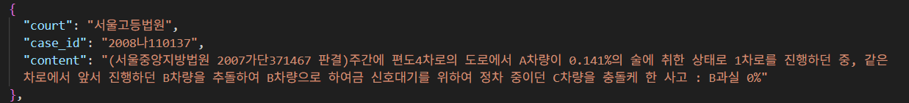

# SKN11-3rd-1Team

 

# 1. 팀 소개

### 팀명 : 🚨사고 정찰단

# 🫡 팀원 소개
| 
[성호진](https://github.com/DawnSurplus)
 | 
[신진슬](https://github.com/SHINJINSEUL)
 | 
[이채은](https://github.com/chaeeunlee05)
 | 
[방성일](https://github.com/SungilBang12)
 | 
[이선호](https://github.com/Seonh0)
 |
|--------|--------|--------|--------|--------|
|   |   |   |   |   |

  

# 2. 프로젝트 개요

<aside>

### 프로젝트 명 < `교통사고 과실비율 산정 AI 챗봇 <노느>` >

  
  
  

</aside>

### 프로젝트 소개

- 교통사고 발생 시 법률 기준과 판례를 기반으로 **과실비율을 신속하게 산정**해주는 AI 챗봇
- 사용자가 사고 상황을 입력하면, 도로교통법, 대법원 판례 등 **복잡한 법률 자료를 자동으로 분석**하여 기본 과실비율과 그에 대한 판단 근거를 제시함.

 

### 프로젝트 필요성(배경)

1. **과실비율 합의의 어려움**
    
    
    
    <출처 : 과실비율정보포털>
    
        
    - 연간 126만 건 이상의 교통사고 발생 시, 당사자 간 주관적 주장으로 인한 분쟁 증가
    - **객관적 기준이 아닌 감정과 오해에 기반한 과실 주장 증가**로 인해, 법적 판단과 다른 무리한 요구가 빈번히 발생하며 공정하고 신속한 과실 산정을 어렵게 만듦
2. 일반인이 이해하기 어려운 법
    - 과실비율이 산정은 전문 지식이 필요한 도로교통법, 민법, 보험약관, 판례 등을 바탕으로 진행
        
    
    - 일반인의 이해 한계로 인해 **불공정한 합의가 이뤄질 가능성**이 큼.
3. **판례 검색의 한계**
    - 사고당사자가 수많은 판례 중에서 자신의 상황에 맞는 사례를 직접 검색하고 법리적 근거를 해석하기란 매우 어렵고 시간이 많이 소요됨.
4. **보험사에 대한 불신**
    - 사고 후 보상 절차에서 표준화된 과실비율 판단 기준이 없거나, 설명이 충분하지 않을 경우 당사자 간 신뢰가 무너지고 보험사에 대한 불신이 커짐.
    - 기사
        
        
        
        “교통사고 현장에서 보험사의 과실비율 짬짜미 때문에 피해보상이 제대로 이뤄지지 않고 있다는 불신이 있다”

   

### 프로젝트 목표

- 일반 개인이 **사고 상황 입력만으로 근거 있는 과실 비율을 예측하여 신속히 받아볼 수 있는 챗봇** 개발
- **도로교통법, 용어, 판례 등의 설명을 질의응답 형태로 제공하는 챗봇** 개발
- 과실비율 산정의 **객관성, 접근성, 이해도**를 동시에 높이는 사용자 친화적 시스템 구축

  

# 3. WBS

# 4. 요구사항 명세서

  

# 5. 기술 스택 & 사용한 모델 (임베딩 모델, LLM)

| 카테고리 | 기술 스택 |
|----------|------------|
| Language |  |
| Development |  |
| Embedding Model |   |
| Vector DB |  |
| LLM Model |  |
| Framework |   |
| Collaboration Tool |     |

  

# 6. 시스템 아키텍처

 

# 7. 시스템 워크플로우

  

# 8. 수집한 데이터 및 전처리 요약

<aside>

### 출처

- 과실비율 정보포털 (https://accident.knia.or.kr/qnaCase)
    - `231107_과실비율인정기준.pdf` : 교통사고 케이스 별 과실비율 적용 기준, 판례에 대한 자료 명시
- 국가정보센터
    - 도로교통법 ([https://www.law.go.kr/법령/도로교통법](https://www.law.go.kr/%EB%B2%95%EB%A0%B9/%EB%8F%84%EB%A1%9C%EA%B5%90%ED%86%B5%EB%B2%95))

  

## 데이터 구조

- ## `car_to_car.json`
    
  ### 🚗 car_to_car.json 데이터 구조

| 필드명            | 데이터 타입 | 설명 |
|-------------------|-------------|------|
| `id`              | string      | 사고 사례 식별자 (예: `"차1"`) |
| `category`        | string      | 사고 유형 카테고리 (예: `"자동차"`) |
| `page`            | integer     | 사고가 등장하는 원본 문서의 페이지 번호 |
| `description`     | string      | 사고 상황 설명 |
| `base_ratio`      | object      | 기본 과실비율 정보 |
| └─ `A`            | integer     | A 차량의 과실 비율 (%) |
| └─ `B`            | integer     | B 차량의 과실 비율 (%) |
| `modifiers`       | array       | 과실 비율 조정 요소 목록 |
| └─ `factor`       | string      | 조정 요소 설명 (예: `"A차량 신호 위반"`) |
| └─ `adjustment`   | string      | 조정값 (예: `"+10%"`, `"-20%"`) |
| `legal_notes`     | array       | 참고 법률 또는 판례 (예: `"도로교통법 제5조"`, `"대법원 2011다3250 판결"`) |

    
   
    
#### 🛠️ 전처리 및 변환 과정

1. **PDF 사고 상황별로 분류**

2. **PDF 파일 read**

3. **머릿말/꼬릿말 제거 후 텍스트 추출**

4. **수정요소(예: `~참조한다`)는 요약문으로 재정리하여 JSON에 적용**

5. **없는 값은 `null`로 명시 처리 (예: 참고 판례 없음)**

     

- ## `precedent.json`
    
    
    ### 📂 판례 JSON 데이터 구조
    
    | **필드명** | **설명** | **데이터 타입** |
    |------------|----------|------------------|
    | `court`    | 판결을 내린 법원명 (예: 대법원, 서울고등법원 등) | `string` |
    | `case_id`  | 사건번호 (예: 2022다12345, 2019가단67890 등) | `string` |
    | `content`  | 판례 요지, 판단 이유 등 본문 텍스트 | `string` |
    

    
   ### 🧾 판례 문서 파싱 단계

    1. **PDF 파일 read 및 텍스트 추출**

    2. **머릿말/꼬릿말 제거**

    3. **`⊙` 기호로 섹션 시작 감지**

    4. **법원명 및 사건 ID 추출**

    5. **내용 수집** (탭 문자 또는 빈 줄 전까지)

     

- ## `load_traffic_law.json`

- 국가 정보센터 홈페이지에서 도로교통법 관련 데이터 확보
    
    
    ### 📘 도로교통법 JSON 데이터 구조
    
    | **필드명** | **설명** | **데이터 타입** |
    |------------|----------|------------------|
    | `조문 제목` | 조문 전체 제목 (예: `"제5조(보행자의 보호)"`) | `string` (key) |
    | `항 번호` | 해당 조문 안의 항목 구분 (예: `"1항"`, `"2항"` 등) | `string` (key) |
    | `항 내용` | 해당 항에 포함된 조문 문장 (한 항에 여러 문장일 수도 있음) | `string[]` |

    
- ## `term.json`

- 과실비율 정보포털 ‘과실비율 용어해설‘ section 크롤링
    
    
    ### 📘 term.json 데이터 구조
    
    | **필드명** | **설명** | **데이터 타입** |
    |------------|----------|------------------|
    | `term`     | 용어명 (예: 도로, 차로, 정차 등) | `string` |
    | `desc`     | 용어에 대한 설명 (1개 이상의 문장으로 구성된 설명 목록) | `string[]` |
    
  

# 9. DB 연동 구현 코드 (링크만)

<aside>

- URL : 
[vector_db_output/vectordb.ipynb](https://github.com/SKNETWORKS-FAMILY-AICAMP/SKN11-3rd-1Team/blob/main/vector_db_output/vectordb.ipynb)

## **DB 연동 구현 내용**
- 각 문서별(판례, 용어, 사고상황) 개별 Document 객체 생성
- OpenAI Embedding 모델로 벡터화
- 각 Document를 컬렉션 별로 나누어 `Chroma DB`로 저장하여 RAG에 최종 적용

  

# 10. 테스트 계획 및 결과 보고서

<aside>

 ## `사고 상황`
 

  
  

 ## `용어`
 

  
  

 ## `도로교통법`
 

  
  

 ## `판례`
 

  
  

  

# 11. 프로그램 개선 노력

### 1. RAG - self리트리버 사용
- 판례’ 검색의 경우, 임베딩 기반 벡터DB의 한계로 숫자와 한글이 섞인 **`"92도2077"`** 같은 고유값을 의미적 유사도 기반으로 찾아오지 못하는 경우 발생
- 리트리버에 필터를 적용하여 메타데이터와 고유값이 일치하는 경우 정상적으로 찾아 오는 것 확인
    - 사용자 입력에서 해당 메타데이터 추출 필요
- self리트리버 적용 시, query에서 자동으로 메타데이터에 해당하는 부분 추출 및 일치하는 부분 search가능
### 2. pdf-json 비교검증 → 정확성 향상
 
### 3. 프롬프트 최적화
    
    
| 번호 | 항목명               | 설명 |
|------|----------------------|------|
| 1    | 🧠 질문 분류          | 사용자의 질문을 사고, 법률, 판례, 용어, 일반 다섯 유형 중 하나로 분류하여 흐름을 제어함 |
| 2    | 🧷 사건 선택 및 연계   | 유사한 사고 사례를 식별하고 사건 ID를 고정 형식으로 출력하여 후속 판단과 연계 |
| 3    | ⚖️ 사고 판단 자동화    | 문서 기반 사례를 분석해 과실비율과 판단 사유를 자동 도출하며 응답 일관성을 확보 |
| 4    | 📚 법률 정보 구조화    | 문서 기반 판례, 조문, 용어를 정형화된 형식으로 요약해 전문성과 응답 품질을 향상 |
| 5    | 💡 일반 지식 대응      | 문서에 없는 질문도 AI의 상식으로 자연스럽고 유연하게 응답 |
    
    
### 4. 파인튜닝

**Bllossom/llama-3.2-Korean-Bllossom-3B**
|  | |
|:------------------------------------:|:------------------------------------:|
| ChromaDB(consine 유사도)|ChromaDB(consine 유사도) **+ qLoRA 파인튜닝**|

**saltlux/Ko-Llama3-Luxia-8B**
|  | |
|:------------------------------------:|:------------------------------------:|
| ChromaDB|ChromaDB **+ qLoRA 파인튜닝**|

**saltlux/Ko-Llama3-Luxia-8B**
|  | |
|:------------------------------------:|:------------------------------------:|
|  **ChromaDB(cosine 유사도)**  **+ qLoRA 파인튜닝**|**FAISS(cosine 유사도)**   **+ qLoRA 파인튜닝**|

  

# 12. 수행결과(테스트/시연 페이지)

  

# 13.추후 업데이트 계획

 ###  파인튜닝
- `장기적인 비용 절감 목표`
- gpt-4o 최신 토큰 처리 `비용이 높다`.
- 비용 절감을 위해 저렴한 모델 사용 또는 무료로 있는 모델→ 파인튜닝
- 우리가 원하는 동작하는 수준만 되도 gpt-4o `(최소 비용감소)`

  

# 한 줄 회고

### 호진

- 데이터 수집부터 전처리, LangChain, RAG, ChromaDB, Fine-Tuning 등 지금까지 배워왔던 부분을 종합적으로 적용해보며 수업 외 많은 경험을 할 수 있는 시간이었습니다. 특히, ‘판례’검색 케이스에서 Retriever가 벡터DB에 있는 사건케이스(고유값)에 해당하는 내용을 가져오지 못하는 문제를 해결하기 위해 다양한 시도를 하며 얻은 아이디어를 바탕으로 프로그램 전체적으로 정확성을 올리는 방향이 된 것 같아 좋은 경험이 되었습니다.

### 성일

- 파인튜닝의 결과가 기대에 못미쳐 성취감이 부족하다. 돌이켜보면 데이터 전처리부터 모델 튜닝까지 수업시간에 배운 내용들을 활용할 수 있어 내가 부족한 부분이 어느 부분인지 짚어볼 수 있는 기회였던 것 같다.

### 채은

- 이번 프로젝트를 통해 AI의 판단 흐름을 구체적으로 설계함으로써 프롬프트 최적화의 중요성과 설계 전략을 깊이 있게 배울 수 있었습니다. 또한 벡터 DB 구축, 코사인 유사도 계산, RAG 기반 질의응답 등 다양한 LLM 응용 기법을 실습하며, 이론으로만 알던 개념을 복습할 수 있는 시간이었습니다.

### 진슬

- 이번 프로젝트를 통해 LangChain의 모듈화된 구조를 이해하고, 문서 기반 검색과 생성형 응답이 결합된 RAG 방식의 장점을 알게 되었습니다. 그리고 특히 사고 상황 유사도를 기반으로 유의미한 판례를 추출하여, 이를 GPT가 근거와 함께 판단하는 흐름이 인상 깊었습니다. 이번 프로젝트를 하면서 가장 많은 경험을 해본 것 같습니다.