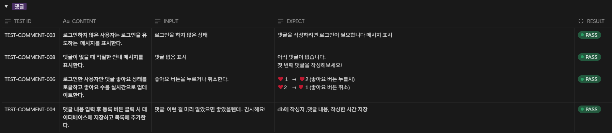

# SKN11-4th-1Team

 

# 1. 팀 소개

### 팀명 : 🚨사고 정찰단

# 🫡 팀원 소개
| 
[성호진](https://github.com/DawnSurplus)
 | 
[신진슬](https://github.com/SHINJINSEUL)
 | 
[이채은](https://github.com/chaeeunlee05)
 | 
[방성일](https://github.com/SungilBang12)
 | 
[이선호](https://github.com/Seonh0)
 |
|--------|--------|--------|--------|--------|
|   |   |   |   |   |

  

# 2. 프로젝트 개요

<aside>

### 프로젝트 명 < `교통사고 과실비율 산정 AI 챗봇 <노느>` >

  
  
  

</aside>

### 프로젝트 소개

- 교통사고 발생 시 법률 기준과 판례를 기반으로 **과실비율을 신속하게 산정**해주는 AI 챗봇
- 사용자가 사고 상황을 입력하면, 도로교통법, 대법원 판례 등 **복잡한 법률 자료를 자동으로 분석**하여 기본 과실비율과 그에 대한 판단 근거를 제시함.

 

### 프로젝트 필요성(배경)

1. **과실비율 합의의 어려움**
    
    
    
    <출처 : 과실비율정보포털>
    
        
    - 연간 126만 건 이상의 교통사고 발생 시, 당사자 간 주관적 주장으로 인한 분쟁 증가
    - **객관적 기준이 아닌 감정과 오해에 기반한 과실 주장 증가**로 인해, 법적 판단과 다른 무리한 요구가 빈번히 발생하며 공정하고 신속한 과실 산정을 어렵게 만듦
2. 일반인이 이해하기 어려운 법
    - 과실비율이 산정은 전문 지식이 필요한 도로교통법, 민법, 보험약관, 판례 등을 바탕으로 진행
        
    
    - 일반인의 이해 한계로 인해 **불공정한 합의가 이뤄질 가능성**이 큼.
3. **판례 검색의 한계**
    - 사고당사자가 수많은 판례 중에서 자신의 상황에 맞는 사례를 직접 검색하고 법리적 근거를 해석하기란 매우 어렵고 시간이 많이 소요됨.

   

### 프로젝트 목표

- 일반 개인이 **사고 상황 입력만으로 근거 있는 과실 비율을 신속히 제공하는 챗봇** 개발
- **도로교통법, 용어, 판례 등의 설명을 질의응답 형태로 제공하는 챗봇** 개발
- **사용자 친화적인 시스템을 구축 및 웹서비스로 제공**하여 과실비율 산정에 대한 이해도를 높임

  

# 3. WBS

  

# 4. [요구사항 명세서🔗](./output/요구사항%20명세서%20작성.pdf)

`[예시 - 메인 페이지]`

  

# 5. 기술 스택 & 사용한 모델 (임베딩 모델, LLM)

| 카테고리 | 기술 스택 |
|----------|------------|
| Language |  |
| Development |  |
| Embedding Model |   |
| Vector DB |  |
| Database |  |
| LLM Model |  |
| Framework |  |
| Deployment |  |
| Collaboration Tool |     |

  

# 6. 시스템 아키텍처

 

# 7. 시스템 워크플로우

  

# 8. [화면 정의서🔗](./output/screen%20definition.pdf)

## `Main 채팅 화면` ##

## `login 화면` ##

## `community 화면` ##

## `signup 화면` ##

  

# 9. 수행결과(테스트/시연 페이지)

`Image 클릭 시 AWS 배포 port번호로 이동`

  

# 10. 테스트 계획 및 결과 보고서

## 사용자 관리 페이지

## 메인 페이지

## 커뮤니티 페이지

## 댓글 페이지

  

# 11. 3차 프로젝트 대비 개선사항
| 번호 | 항목명                           | 설명                                                                                                    |
|------|----------------------------------|---------------------------------------------------------------------------------------------------------|
| 1    | ☁️ 클라우드 인프라 확장          | AWS 클라우드 인프라(E2C, RDS 등) 기반으로 시스템을 분리 및 확장.                                      |
| 2    | 🧩 컴포넌트 분리 및 관리         | EC2 인스턴스에서 LLM과 벡터 DB를 운영하고, 별도의 RDS(MySQL)로 데이터베이스를 분리하여 관리.         |
| 3    | ⚖️ 다양한 사고 유형에 대한 대응력 강화 | car_to_pedestrian.json, car_to_mobility.json 데이터 검증 완료 후 차vs보행자, 차vs농기구(자전거)사고 유형에 대한 응답 출력 |
| 4    | 🎨 UI 유지보수성 및 확장성 향상    | Streamlit으로 구현했던 UI를 Django로 개선함으로써 확장성, 보안, 사용자 관리, 디자인 자유도 등 전반적인 서비스 품질 향상 |

  

# 한 줄 회고

### 호진

- 데이터 수집부터 전처리, LangChain, RAG, ChromaDB, Fine-Tuning 등 지금까지 배워왔던 부분을 종합적으로 적용해보며 수업 외 많은 경험을 할 수 있는 시간이었습니다. 특히, ‘판례’검색 케이스에서 Retriever가 벡터DB에 있는 사건케이스(고유값)에 해당하는 내용을 가져오지 못하는 문제를 해결하기 위해 다양한 시도를 하며 얻은 아이디어를 바탕으로 프로그램 전체적으로 정확성을 올리는 방향이 된 것 같아 좋은 경험이 되었습니다.

### 성일

- 파인튜닝의 결과가 기대에 못미쳐 성취감이 부족하다. 돌이켜보면 데이터 전처리부터 모델 튜닝까지 수업시간에 배운 내용들을 활용할 수 있어 내가 부족한 부분이 어느 부분인지 짚어볼 수 있는 기회였던 것 같다.

### 채은

- 이번 프로젝트를 통해 AI의 판단 흐름을 구체적으로 설계함으로써 프롬프트 최적화의 중요성과 설계 전략을 깊이 있게 배울 수 있었습니다. 또한 벡터 DB 구축, 코사인 유사도 계산, RAG 기반 질의응답 등 다양한 LLM 응용 기법을 실습하며, 이론으로만 알던 개념을 복습할 수 있는 시간이었습니다.

### 진슬

- 이번 프로젝트를 통해 LangChain의 모듈화된 구조를 이해하고, 문서 기반 검색과 생성형 응답이 결합된 RAG 방식의 장점을 알게 되었습니다. 그리고 특히 사고 상황 유사도를 기반으로 유의미한 판례를 추출하여, 이를 GPT가 근거와 함께 판단하는 흐름이 인상 깊었습니다. 이번 프로젝트를 하면서 가장 많은 경험을 해본 것 같습니다.